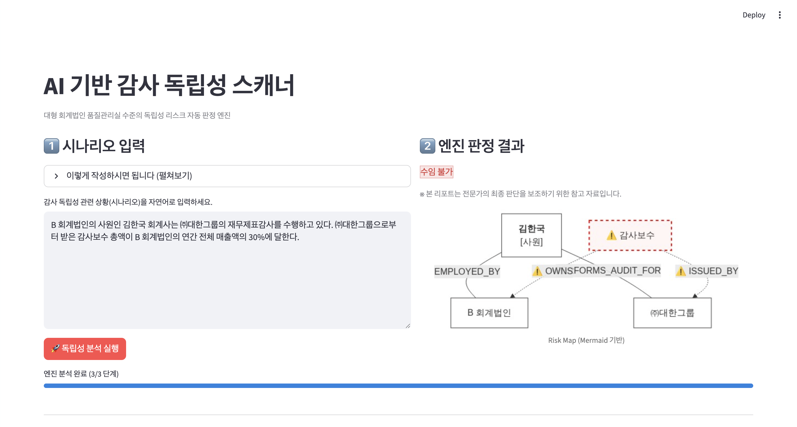
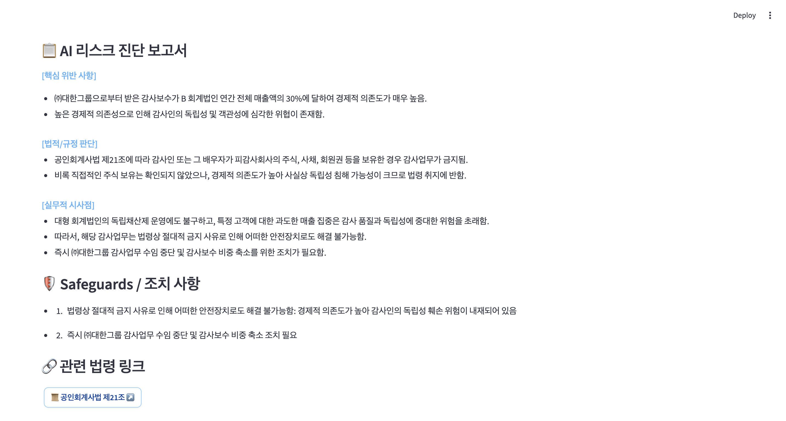

## AI 기반 감사 독립성 스캐너

감사 독립성 이슈를 대상으로 한 **LLM + Graph DB 지식그래프 프로토타입**입니다.  
자연어 시나리오를 온톨로지 기반 그래프로 변환하고, 규정 매핑과 전문가 의견, 시각 리스크 맵까지 한 번에 생성합니다.

---

### 1. 아키텍처 개요

```bash
AUDIT_DEMO/
├── backend/            # FastAPI 관련 코드
│   ├── app.py          # FastAPI 실행 메인 (엔트리포인트)
│   └── services/
│       └── engine.py   # 온톨로지/그래프 + LLM 비즈니스 로직
├── frontend/           # Streamlit 관련 코드
│   └── main.py         # Streamlit 대시보드 메인
├── common/
│   └── config.py       # 공통 설정 (모델명, BACKEND_URL, .env 로드 등)
├── assets/             # README에 사용된 스크린샷 등
├── .env                # 환경변수 (API 키 등, 버전관리 제외 권장)
├── requirements.txt    # 파이썬 의존성
└── README.md
```

- **`backend/services/engine.py` – Ontology / Graph 엔진**
  - 텍스트 → Graph JSON (`stage1_nlp_to_graph`)
    - LLM으로 `Person / Organization / Engagement / FinancialInterest` 등 노드·관계 추출
  - Graph → 규정 컨텍스트 (`stage2_inject_law_context`)
    - 주식·지분·차입·자문 키워드 기반 법령 매핑
  - Graph + 규정 → 전문가 의견 JSON (`stage3_expert_analysis`)
    - `"수임 불가" / "안전장치 적용 시 수임 가능" / "수임 가능"` 세 상태로 독립성 판정
  - Graph → Mermaid 리스크 맵 (`build_graph_image_url`)
    - 위험 노드·엣지를 시각적으로 강조

- **`backend/app.py` – FastAPI REST API**
  - `POST /analyze` : 전체 파이프라인 실행 후 JSON 응답
  - `GET /health`  : 헬스 체크
  - status 문자열을 사후 정규화하여 세 가지 상태 값만 노출

- **`frontend/main.py` – 웹 대시보드**
  - 좌측: 시나리오 입력 + 접을 수 있는 작성 가이드(expander)
  - 우측: 판정 결과 배지 + 리스크 맵 + HTML 의견서 + Safeguards + 법령 링크
  - 진행률 바(3단계)와 세션 상태 유지로 사용자 경험 개선

- **`common/config.py` / `.env` – 설정 / 보안**
  - OpenAI 모델, 백엔드 URL 설정
  - `OPENAI_API_KEY` 는 `.env` 또는 운영 환경변수로만 주입

---

### 2. 온톨로지·지식그래프 설계 및 Neo4j 연동 관점

**도메인 온톨로지 (요약)**  
- 노드 타입: `Person`, `Organization`, `Engagement`, `FinancialInterest`  
- 관계 타입: `EMPLOYED_BY`, `PERFORMS_AUDIT_FOR`, `OWNS`, `BORROWED_FROM`, `PART_OF` 등  
- LLM이 생성한 그래프는 `{"nodes": [...], "relationships": [...]}` 구조의 JSON으로 표현됩니다.

**Neo4j 적재 예시 (Cypher)** – 이 JSON은 아래와 같이 바로 적재할 수 있습니다.

```cypher
UNWIND $nodes AS n
MERGE (node:Entity {id: n.id})
SET node += n.properties;

UNWIND $relationships AS r
MATCH (s:Entity {id: r.source_id})
MATCH (t:Entity {id: r.target_id})
MERGE (s)-[rel:REL {type: r.type}]->(t);
```

이후 Cypher/SPARQL 계층을 추가해:
- 지분율·보수 의존도·겸직 여부 등에 대한 패턴을 정의하고
- 규칙 기반 탐지와 LLM 기반 판정을 결합하는 Graph RAG 구조로 확장 가능합니다.

---

### 3. LLM 기반 (반)자동 파이프라인

1. **텍스트 → Graph JSON**
   - Chat Completions API + JSON 응답 모드 활용
2. **Graph → 규정 컨텍스트**
   - 그래프 내용 기반 규정 요약 텍스트 생성 (공인회계사법, 외부감사법 등)
3. **Graph + 규정 → 전문가 의견 JSON**
   - 품질관리 파트너 역할의 프롬프트로 status·사유·Safeguards·relevant_laws 생성
4. **Graph → Risk Map**
   - Mermaid DSL → mermaid.ink 이미지 URL로 변환, Streamlit에서 렌더링

이 구조는 **Graph DB(Neo4j) + 벡터 검색(Vector Search)** 를 추가해 Graph RAG로 확장하기 쉽게 설계되어 있습니다.

---

### 4. 로컬 실행 방법

#### 4-1. 의존성 설치

```bash
cd audit_demo
python -m venv .venv
source .venv/bin/activate      # Windows: .venv\Scripts\activate
pip install -r requirements.txt
```

#### 4-2. 환경 변수 설정

루트 디렉토리에 `.env` 파일을 만들고:

```bash
OPENAI_API_KEY=sk-...당신의키...
```

필요 시:

```bash
# 선택 사항: 기본 모델/백엔드 URL 변경
OPENAI_MODEL_GRAPH=gpt-4.1-mini
OPENAI_MODEL_ANALYSIS=gpt-4.1-mini
BACKEND_URL=http://127.0.0.1:8000
```

#### 4-3. 서버 실행

```bash
# 터미널 1 – FastAPI 백엔드
source .venv/bin/activate
uvicorn backend.app:app --reload --host 127.0.0.1 --port 8000

# 터미널 2 – Streamlit 프론트엔드
source .venv/bin/activate
streamlit run frontend/main.py --server.address 127.0.0.1 --server.port 8501
```

브라우저에서 `http://127.0.0.1:8501` 로 접속합니다.

---

### 5. UX 스크린샷

#### 5-1. 메인 분석 화면



#### 5-2. 리스크 진단 보고서



스크린샷 파일은 `assets/` 디렉토리에 포함되어 있습니다.

---

### 6. 튜닝 포인트

- **시나리오 작성 가이드**: `frontend/main.py` 내 expander 문구
- **기본 예시 시나리오**: `frontend/main.py` 의 `default_scenario` 문자열
- **법령 컨텍스트 규칙**: `backend/services/engine.py` 의 `stage2_inject_law_context()`  
  - 키워드(예: `"지분"`, `"차입"`)와 설명 문구를 추가/수정
- **판정 기준 튜닝**: `backend/services/engine.py` 의 `stage3_expert_analysis()`  
  - `status` 세 가지 상태에 대한 설명을 바꾸어 보수/완화 정도 조정 가능

---

### 7. 보안 및 운영 관점 메모

- **API 키 하드코딩 금지**: 코드 어디에도 키를 직접 넣지 않고, `.env` / 환경변수만 사용
- **레이어 분리**:
  - 엔진(`backend/services/engine.py`)은 FastAPI/Streamlit과 분리되어 있어,  
    추후 모바일/사내 포털 등 다른 UI에서 재사용 가능
- **로깅/모니터링 (향후)**:
  - 운영 배포 시 FastAPI 레벨에서 호출 로그(입력 길이, 응답시간, status 분포 등) 수집 권장
  - 민감한 시나리오 텍스트는 반드시 마스킹·익명화 후 로그에 남기도록 추가 설계 필요

